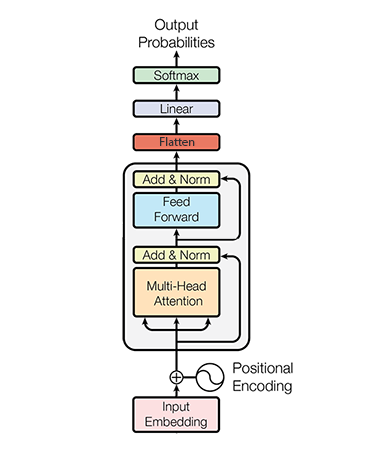

# transformer-text-classifier
Vietnamese Text Classifier using Transformer model

[](https://github.com/suicao/transformer-text-classifier)

## Web Demo

You can view the web demo [here](http://ec2-13-58-206-114.us-east-2.compute.amazonaws.com/)

Or you can use the the following API to get the results directly.

Method: ```POST```

URL: ```http://13.58.206.114/clf```

Request Body: ```{
"data": "đội tuyển bồ đào nha của ronaldo đã phải về nước sau thất bại trước uruguay"
}```

Response: ```{"sent": <the formatted sentence>, "probs": <probabilies over each class>, "attns": <attention values over each token in the sentence>, "pred": <predicted class id>}```
## Model Architecture



## Testing Results
### Testing with random text

```python infer.py --mode clf --prime "đội tuyển bồ đào nha của ronaldo đã phải về nước sau thất bại trước uruguay"```

### Testing the model on VNTC dataset

```python infer.py --mode test --input_path <path-to-data>/VNTC/corpus/test/```
### Confusion Matrix


|			| chính trị | đời sống  | khoa học   | kinh doanh| pháp luật | sức khỏe  | thế giới  | thể thao  | văn hóa   | vi tính   |
|-----------|-----------|-----------|-----------|-----------|-----------|-----------|-----------|-----------|-----------|-----------|
|chính trị	|6655		|   54		|   51		|  234		|  245		|   81		|   49		|   27		|  120		|	      51|
|đời sống	|310 		| 1163		|  107		|   33		|   50		|   82		|   62		|   20		|  187		|	      22|
|khoa học 	|190 		|  129		| 1367		|   34		|    6		|  192		|   60		|    7		|   64		|	      47|
|kinh doanh	|385 		|   12		|   12		| 4556		|   70		|   14		|   85		|    5		|   16		|	     121|
|pháp luật	|304 		|   13		|    2		|   69		| 3328		|   16		|    2		|   23		|   18		|	      13|
|sức khỏe	|163 		|   77		|   97		|   21		|   24		| 4936		|   71		|    7		|    9		|	      12|
|thế giới	|176 		|   26		|   67		|   86		|   46		|   50		| 6103		|   41		|   83		|	      38|
|thể thao	| 23 		|   25		|    4		|    3		|   17		|    6		|   27		| 6535		|   25		|	       2|
|văn hóa	|217 		|  298		|   53		|   15		|   46		|   30		|  127		|   46		| 5397		|	      21|
|vi tính	|101 		|   24		|   36		|   56		|   24		|    4		|   30		|   12		|   28		|	    4245|

## Training 

Coming soon
